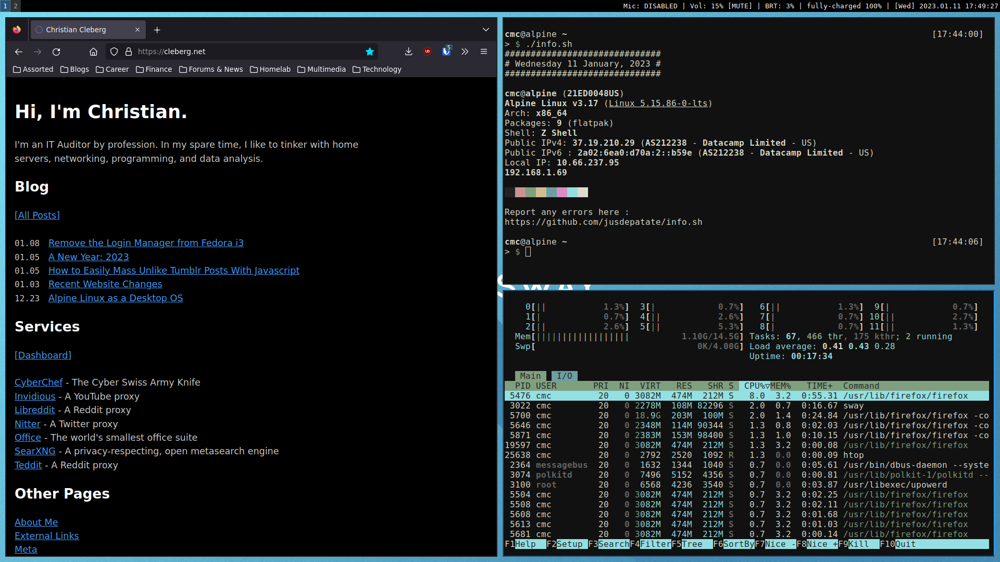

# dotfiles

A collection of the various dotfiles for my current Linux desktop setup.

## Current OS & DE

I am currently running [Alpine Linux](https://alpinelinux.org) with 
[sway](https://swaywm.org/).

## Dotfiles

- alacritty
- bash
- i3
- nano
- neomutt
- newsboat
- polybar
- sway
- zsh

## Screenshots

