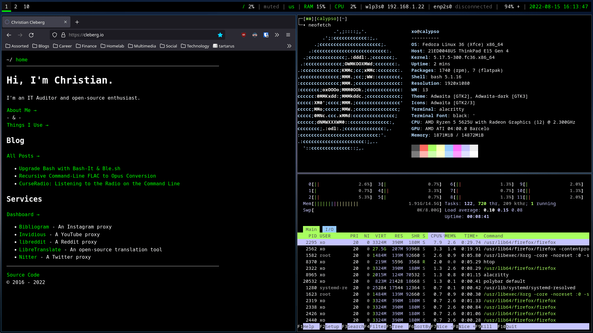

# dotfiles

A collection of the various dotfiles for my current GNU+Linux setup.

## Current OS & DE

I am currently running Fedora 36 with the i3wm desktop.

## Dotfiles

- bash
- i3
- nano
- neomutt
- newsboat
- polybay

## Screenshots

